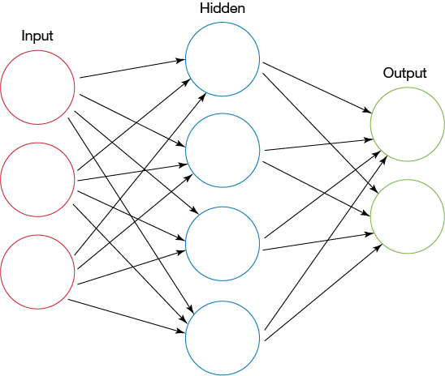

# Neural-Network-From-Scratch
Simple neural network created with python

In this repository you can find Neural Network written in numpy from scratch, with some theory explanation and methamatical background
connected to this subject and some intuition related to. It's one of the most basic models in machine learning.

Repo created in colaboration with [@FeederDiver](https://github.com/FeederDiver)

The main file in this repo is Neural_net.ipynb

## How to run:
After downloading this repo you have to unpack all data files in Neural_net/mnist_data . You can do it using 7zip on windows, or any other compressor.

## Required Python Packages
1. matplotlib
2. numpy
3. tqdm
